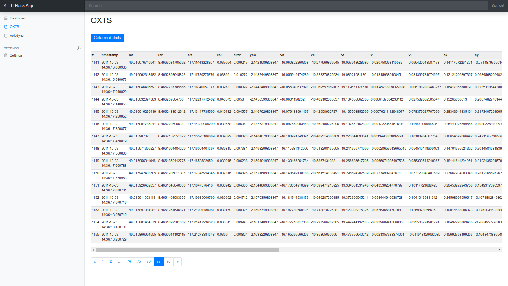

# KITTI Flask demo application


### Screenshot




### Requirements

- python (>=3.5)
- Flask
- Pandas
- PyTables


### Project Structure

- kittiproject  
-- dataset (KITTI dataset files)  
-- flaskapp (Flask application)  
--- application (Core application and template files)  
--- data (KITTI data storage files)  
--- logs (Flask application log files)  
--- static (CSS and JavaScript files)  
--- config.py (Flask app configuration)  
--- main.py (Main entry point)  
--- run (Run app script)  
-- migration (imports KITTI data to a H5 file)


### Installation

Navigate to project directory.  
Optionally install virtual environment with:
```
virtualenv env -p python3
```
Start virtual environment with:
```
. env/bin/activate
```
Install required Python libraries with:
```
pip install -r requirements.txt
```


### Configuration

Make sure that appropriate port (default one is 4000) is free before running the application. You can change the port in PROJECT_DIR/config.py file by changing the PORT constant.  
Set Flask secret key
```
export FLASKAPP_KEY=demo
```


### Usage

From the project directory execute:
```
./run
```
or
```
python3 main.py
```
Open http://localhost:4000/ or http://127.0.0.1:4000/ in your web browser. 


### Credentials

username: demo  
password: demo


### API

API key: demo:ZGVtb3Rva2Vu  

Endpoint: /api
```
curl --request GET \
  --url 'http://localhost:4000/api/'
```
Response:
```
{
  "message": string, 
  "status": bool, 
  "version": string
}
```
Endpoint (requires authentication): /api/oxts
```
curl --request GET \
  --url 'http://localhost:4000/api/oxts' \
  --header 'authorization: Bearer demo:ZGVtb3Rva2Vu'
```
Response:
```
{
  "data": {
    "oxts": list[dict], 
    "total_pages": int
  }, 
  "status": bool
}
```
Endpoint with filter (requires authentication): /api/oxts?timestamp=2011-10-03%2014%3A34%3A34.102597
```
curl --request GET \
  --url 'http://localhost:4000/api/oxts?timestamp=2011-10-03%2014%3A34%3A34.102597' \
  --header 'authorization: Bearer demo:ZGVtb3Rva2Vu'
```


### Unit tests

From the flaskapp directory execute:
```
python -m unittest discover tests -v
```
or just
```
make test
```

